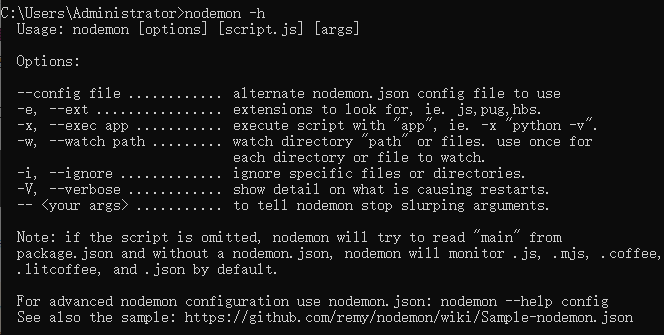
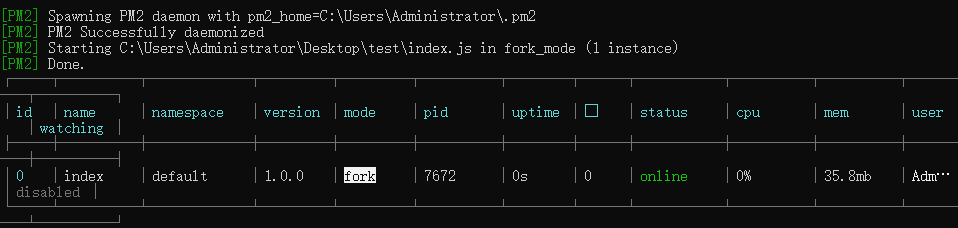

我们在开发node项目时，每次更改文件，都需要重新跑一遍node项目，这让开发效率会降低不少，我们可以利用**nodemon**工具去帮助我们监听文件的变更，自动重启服务。
对于node项目的部署，可以利用pm2去帮助我们实现。PM2是node进程管理工具，可以利用它来简化很多node应用管理的繁琐任务，如性能监控、自动重启、负载均衡等，而且使用非常简单。
## nodemon的使用
### 安装
全局安装
```
npm install -g nodemon
```
### 使用
```
nodemon index.js
```
nodemon也可以进行配置，通过配置命令行使用，也可通过配置nodemon.json文件来使用。
其配置选项，如下图所示
<div></div>

- --config 可设置指定配置文件
- --ext 设置监听文件的后缀扩展名，如想要监听ts文件的变更，需设置-e ts
- --exec 执行脚本
- --watch 设置要监听的文件路径
- --ignore 设置无需监听的文件路径

其option 转化逻辑为

读命令行参数--->若无，查找本地local配置文件-->若无，查找全局配置文件->若无，尝试package.json中的main和start-->查找index.js

命令行
```
nodemon --watch src/ -e js,coffee app.js
```
相当于配置文件
```
{
  watch: ['src/'],
  ignore: [],
  script: 'app.js'
  options: {
    extensions: ['js', 'coffee'],
    exec: 'node'
  }
}
```

nodemon有两种配置方式
- 创建nodemon.json
```
{
  "verbose": true,
  "ignore": ["*.test.js", "fixtures/*"],
  "execMap": {
    "rb": "ruby",
    "pde": "processing --sketch={{pwd}} --run"
  }
}
```

- 在package.json中配置
```
{
  "name": "nodemon",
  "homepage": "http://nodemon.io",
  "...": "... other standard package.json values",
  "nodemonConfig": {
    "ignore": ["test/*", "docs/*"],
    "delay": "2500"
  }
}
```

#### 延迟重启
  
这个就类似于js函数中的函数节流,只在最后一次更改的文件往后延迟重启.避免了短时间多次重启的局面.
```
nodemon -delay10 main.js

nodemon --delay 2.5 server.js

nodemon --delay 2500ms server.js
```

## pm2的使用
### 安装
```
npm install -g pm2
```
pm2安装好后，会自动创建下面目录。
- ```$HOME/.pm2``` will contain all PM2 related files
- ```$HOME/.pm2/logs``` will contain all applications logs
- ```$HOME/.pm2/pids``` will contain all applications pids
- ```$HOME/.pm2/pm2.log``` PM2 logs
- ```$HOME/.pm2/pm2.pid``` PM2 pid
- ```$HOME/.pm2/rpc.sock``` Socket file for remote commands
- ```$HOME/.pm2/pub.sock``` Socket file for publishable events
- ```$HOME/.pm2/conf.js``` PM2 Configuration

### 使用
#### 常用命令
1. 启动服务pm2 start <script_file|config_file> [options] 启动指定应用
```
pm2 start app.js                //启动app.js应用
pm2 start app.js --name app    //启动应用并设置name
pm2 start app.sh                //脚本启动

pm2 start app.js --watch    //监听模式启动，当文件发生变化，自动重启

//max 表示PM2将自动检测可用CPU的数量并运行尽可能多的进程
//max可以自定义，如果是4核CPU，设置为2则占用2个
pm2 start app.js -i max //启用群集模式（自动负载均衡）

pm2-dev start ... // 开发模式启动，即不启用后台运行
```
<div></div>

2. 查看启动列表pm2 list
3. 显示应用程序详细信息pm2 show <appName> [options] 显示指定应用详情
```
pm2 show [Name]      //根据name查看
pm2 show [ID]        //根据id查看
```
<div></div>

4. 停止指定应用pm2 stop <appName> [options] 停止指定应用
```
pm2 stop all               //停止所有应用
pm2 stop [AppName]        //根据应用名停止指定应用
pm2 stop [ID]             //根据应用id停止指定应用
```
5. 重启应用pm2 reload|restart <appName> [options] 重启指定应用
```
pm2 restart app.js        //同时杀死并重启所有进程，短时间内服务不可用,生成环境慎用
pm2 reload app.js        //重新启动所有进程，0秒重启，始终保持至少一个进程在运行
pm2 gracefulReload all   //以群集模式重新加载所有应用程序
```
6. 启动静态服务器pm2 serve ./dist 8080将目录dist作为静态服务器根目录，端口为8080
7. 删除应用pm2 delete <appName> [options] 删除指定应用;如果修改了应用配置行为，需要先删除应用，重新启动后方才会生效，如修改脚本入口文件；
```
pm2 delete all               //关闭并删除应用
pm2 delete [AppName]        //根据应用名关闭并删除应用
pm2 delete [ID]            //根据应用ID关闭并删除应用
```
8. ```pm2 kill``` 杀掉pm2管理的所有进程;
9. ```pm2 logs <appName>``` 查看指定应用的日志，即标准输出和标准错误
```
pm2 logs            //查看所有应用日志
pm2 logs [Name]    //根据指定应用名查看应用日志
pm2 logs [ID]      //根据指定应用ID查看应用日志
pm2 monit 监控各个应用进程cpu和memory使用情况；
```
10. ```pm2 monit``` 监控各个应用进程cpu和memory使用情况；

### 常用配置项
```
apps： json结构，apps是一个数组，每一个数组成员就是对应一个pm2中运行的应用；

name：应用程序名称；

cwd：应用程序所在的目录；

script：应用程序的脚本路径；

log_date_format： 指定日志日期格式，如YYYY-MM-DD HH：mm：ss；

error_file：自定义应用程序的错误日志文件，代码错误可在此文件查找；

out_file：自定义应用程序日志文件，如应用打印大量的标准输出，会导致pm2日志过大；

pid_file：自定义应用程序的pid文件；

interpreter：指定的脚本解释器；

interpreter_args：传递给解释器的参数；

instances： 应用启动实例个数，仅在cluster模式有效，默认为fork；

min_uptime：最小运行时间，这里设置的是60s即如果应用程序在60s内退出，pm2会认为程序异常退出，此时触发重启max_restarts设置数量；

max_restarts：设置应用程序异常退出重启的次数，默认15次（从0开始计数）；

autorestart ：默认为true, 发生异常的情况下自动重启；

cron_restart：定时启动，解决重启能解决的问题；

max_memory_restart：最大内存限制数，超出自动重启；

watch：是否启用监控模式，默认是false。如果设置成true，当应用程序变动时，pm2会自动重载。这里也可以设置你要监控的文件。

ignore_watch：忽略监听的文件夹，支持正则表达式；

merge_logs： 设置追加日志而不是新建日志；

exec_interpreter：应用程序的脚本类型，默认是nodejs；

exec_mode：应用程序启动模式，支持fork和cluster模式，默认是fork；

autorestart：启用/禁用应用程序崩溃或退出时自动重启；

vizion：启用/禁用vizion特性(版本控制)；

env：环境变量，object类型；

force：默认false，如果true，可以重复启动一个脚本。pm2不建议这么做；

restart_delay：异常重启情况下，延时重启时间；
```


## 部署node项目
在写好配置文件后
远程服务器更新代码进行打包然后执行pm2运行的命令
```
npm run pm2 startOrGracefulReload pm2.config.js
```
将项目部署到pm2上

再利用nginx做代理，将域名映射到某端口上，然后访问域名就能访问到pm2上部署的项目。