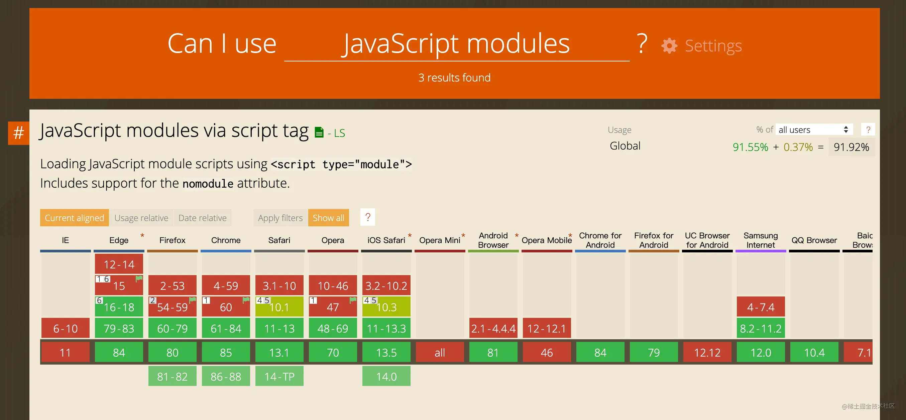

- vite特点 
    - 快速的冷启动
    - 即时的热模块更新
    - 真正的按需编译

Vite，一个基于浏览器原生 ES imports 的开发服务器。利用浏览器去解析 imports，在服务器端按需编译返回，完全跳过了打包这个概念，服务器随起随用

 vite 主要特色是基于浏览器原生的 ES Module 来开发，从而实现按需编译，也就没有打包这个概念——因为需要什么资源直接在浏览器里引入即可（snowpack也是用ES Module）（vite生产环境用rollup）

Vite 的主要功能就是通过劫持浏览器的这些请求，并在后端进行相应的处理将项目中使用的文件通过简单的分解与整合，然后再返回给浏览器，vite整个过程中没有对文件进行打包编译，所以其运行速度比原始的webpack开发编译速度快出许多！


Vite 通过在一开始将应用中的模块区分为 依赖 和 源码 两类，改进了开发服务器启动时间

- 预构建
    - CommonJS 和 UMD 兼容性: 开发阶段中，Vite 的开发服务器将所有代码视为原生 ES 模块。因此，Vite 必须先将作为 CommonJS 或 UMD 发布的依赖项转换为 ESM。
    当转换 CommonJS 依赖时，Vite 会执行智能导入分析，这样即使导出是动态分配的（如 React），按名导入也会符合预期效果：
    ```
    // 符合预期
    import React, { useState } from 'react'
    ```
    - 性能： Vite 将有许多内部模块的 ESM 依赖关系转换为单个模块，以提高后续页面加载性能。
    一些包将它们的 ES 模块构建作为许多单独的文件相互导入。例如，lodash-es 有超过 600 个内置模块！当我们执行 import { debounce } from 'lodash-es' 时，浏览器同时发出 600 多个 HTTP 请求！尽管服务器在处理这些请求时没有问题，但大量的请求会在浏览器端造成网络拥塞，导致页面的加载速度相当慢。
    通过预构建 lodash-es 成为一个模块，我们就只需要一个 HTTP 请求了！

在 Vite 中，HMR 是在原生 ESM 上执行的。当编辑一个文件时，Vite 只需要精确地使已编辑的模块与其最近的 HMR 边界之间的链失效（大多数时候只需要模块本身），使 HMR 更新始终快速，无论应用的大小。


为什么生产环境仍需打包
尽管原生 ESM 现在得到了广泛支持，但由于嵌套导入会导致额外的网络往返，在生产环境中发布未打包的 ESM 仍然效率低下（即使使用 HTTP/2）。为了在生产环境中获得最佳的加载性能，最好还是将代码进行 tree-shaking、懒加载和 chunk 分割（以获得更好的缓存）。

要确保开发服务器和生产环境构建之间的最优输出和行为一致并不容易。所以 Vite 附带了一套 构建优化 的 构建命令，开箱即用。

为何不用 ESBuild 打包？
虽然 esbuild 快得惊人，并且已经是一个在构建库方面比较出色的工具，但一些针对构建 应用 的重要功能仍然还在持续开发中 —— 特别是代码分割和 CSS 处理方面。就目前来说，Rollup 在应用打包方面更加成熟和灵活。尽管如此，当未来这些功能稳定后，我们也不排除使用 esbuild 作为生产构建器的可能。





- webpack

早期 Webpack 刚出来的时候，是为了解决低版本浏览器不支持 ESM 模块化的问题，将各个分散的 JavaScript 模块合并成一个文件，同时将多个 JavaScript 脚本文件合并成一个文件，减少 HTTP 请求的数量，有助于提升页面首次访问的速度。后期 Webpack 乘胜追击，引入了 Loader、Plugin 机制，提供了各种构建相关的能力（babel转义、css合并、代码压缩），取代了同期的 Browserify、Gulp。

