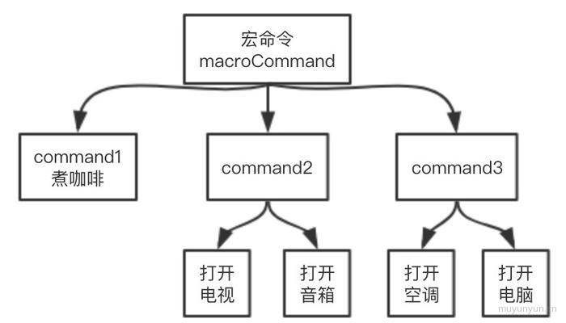

## 常见的设计模式

* [单例模式](#单例模式)

 * [策略模式](#策略模式)

 * [代理模式](#代理模式)

 * [观察者模式](#观察者模式)

 * [发布-订阅模式](#发布-订阅模式)

 * [组合模式](#组合模式)

 * [职责链模式](#职责链模式)

 * [中介者模式](#中介者模式)

* [装饰者模式](#装饰者模式)

* [适配者模式](#适配者模式)
### 单例模式
单例模式两个条件：
- 确保只有一个实例
- 可以全局访问

#### 适用
适用于弹框、toast的实现, 全局缓存

#### 实现
```
const getSingle = function(fn) {
  let result
  return function() {
    return result || (result = fn.apply(this, arguments))
  }
}
```

### 策略模式
根据不同参数可以命中不同的策略

优点：
- 能减少大量的 if 语句
- 复用性好
#### 实现
```
const S = function(salary) {
  return salary * 4
}

const A = function(salary) {
  return salary * 3
}

const B = function(salary) {
  return salary * 2
}

const calculateBonus = function(func, salary) {
  return func(salary)
}

calculateBonus(A, 10000) // 30000
```

### 代理模式
常用的虚拟代理形式：某一个花销很大的操作，可以通过虚拟代理的方式延迟到这种需要它的时候才去创建（例：使用虚拟代理实现图片懒加载）

当你负责的模块，基本满足以下情况时
- 模块职责单一且可复用
- 两个模块间的交互需要一定限制关系

举例

假设当 A 在心情好的时候收到花，小明表白成功的几率有 60%，而当 A 在心情差的时候收到花，小明表白的成功率无限趋近于 0。
小明跟 A 刚刚认识两天，还无法辨别 A 什么时候心情好。如果不合时宜地把花送给 A，花 被直接扔掉的可能性很大，这束花可是小明吃了 7 天泡面换来的。
但是 A 的朋友 B 却很了解 A，所以小明只管把花交给 B，B 会监听 A 的心情变化，然后选 择 A 心情好的时候把花转交给 A

代码实现

```
var Flower = function(){};
var xiaoming = {
    sendFlower: function( target){
        var flower = new Flower();
        target.receiveFlower( flower ); 
    }
};
var B = {
    receiveFlower: function( flower ){
        A.listenGoodMood(function(){ 
            var flower = new Flower(); 
            A.receiveFlower( flower );
        }); 
    }
};
var A = {
    receiveFlower: function( flower ){
        // 监听 A 的好心情
        console.log( '收到花 ' + flower ); 
    },
    listenGoodMood: function( fn ){
        setTimeout(function(){ // 假设 10 秒之后 A 的心情变好
            fn(); 
        }, 10000 );
    } 
};
xiaoming.sendFlower( B );
```

由上面的例子可以引出两种代理模式

- 保护代理
代理 B 可以帮助 A 过滤掉一些请求，比如送花的人中年龄太大的或者没有宝马的，这种请求就可以直接在代理 B 处被拒绝掉
- 虚拟代理
假设现实中的花价格不菲，导致在程序世界里，new Flower 也是一个代价昂贵的操作， 那么我们可以把 new Flower 的操作交给代理 B 去执行，代理 B 会选择在 A 心情好时再执行 new Flower

### 观察者模式
当一个对象的状 态发生改变时，所有依赖于它的对象都将得到通知

举例

当观察的数据对象发生变化时, 自动调用相应函数。比如 vue 的双向绑定;

当改变 obj 中的 value 的时候, 自动调用相应相关函数：
```
var obj = {
  data: { list: [] },
}

Object.defineProperty(obj, 'list', {
  get() {
    return this.data['list']
  },
  set(val) {
    console.log('值被更改了')
    this.data['list'] = val
  }
})
```

**Proxy**

Proxy/Reflect 是 ES6 引入的新特性, 也可以使用其完成观察者模式, 示例如下(效果同上):
```
var obj = {
  value: 0
}

var proxy = new Proxy(obj, {
    // @params {value: 0}  "value"  1  Proxy {value: 0}
  set: function(target, key, value, receiver) { 
    console.log('调用相应函数')
    Reflect.set(target, key, value, receiver)
  }
})

proxy.value = 1 // 调用相应函数
```

### 发布-订阅模式
事件发布/订阅模式 (PubSub) 在异步编程中帮助我们完成更松的解耦, 甚至在 MVC、MVVC 的架构中以及设计模式中也少不了发布-订阅模式的参与。

优点: 在异步编程中实现更深的解耦

缺点: 如果过多的使用发布订阅模式, 会增加维护的难度

#### 代码实现
```
var Event = function() {
  this.obj = {}
}

Event.prototype.on = function(eventType, fn) {
  if (!this.obj[eventType]) {
    this.obj[eventType] = []
  }
  this.obj[eventType].push(fn)
}

Event.prototype.emit = function() {
  var eventType = Array.prototype.shift.call(arguments)
  var arr = this.obj[eventType]
  for (let i = 0; i < arr.length; i++) {
    arr[i].apply(arr[i], arguments)
  }
}

var ev = new Event()

ev.on('click', function(a) { // 订阅函数
  console.log(a) // 1
})

ev.emit('click', 1)          // 发布函数
```

### 组合模式

* 组合模式在对象间形成`树形结构`;
* 组合模式中基本对象和组合对象被`一致对待`;
* 无须关心对象有多少层, 调用时只需在根部进行调用;

### demo1 —— 宏命令

想象我们现在手上有个万能遥控器, 当我们回家, 按一下开关, 下列事情将被执行:

```
1. 煮咖啡
2. 打开电视、打开音响
3. 打开空调、打开电脑
```

我们把任务划分为 3 类, 效果图如下:



接着看看结合了命令模式和组合模式的具体实现:

```js
const MacroCommand = function() {
  return {
    lists: [],
    add: function(task) {
      this.lists.push(task)
    },
    excute: function() { // ①: 组合对象调用这里的 excute,
      for (let i = 0; i < this.lists.length; i++) {
        this.lists[i].excute()
      }
    },
  }
}
const command1 = MacroCommand() // 基本对象
command1.add({
  excute: () => console.log('煮咖啡') // ②: 基本对象调用这里的 excute,
})
const command2 = MacroCommand() // 组合对象
command2.add({
  excute: () => console.log('打开电视')
})
command2.add({
  excute: () => console.log('打开音响')
})
const command3 = MacroCommand()
command3.add({
  excute: () => console.log('打开空调')
})
command3.add({
  excute: () => console.log('打开电脑')
})
const macroCommand = MacroCommand()
macroCommand.add(command1)
macroCommand.add(command2)
macroCommand.add(command3)
macroCommand.excute()
// 煮咖啡
// 打开电视
// 打开音响
// 打开空调
// 打开电脑
```

可以看出在组合模式中基本对象和组合对象被一致对待, 所以要**保证基本对象(叶对象)和组合对象具有一致方法**。

### demo2 —— 扫描文件夹

扫描文件夹时, 文件夹下面可以为另一个文件夹也可以为文件, 我们希望统一对待这些文件夹和文件, 这种情形适合使用组合模式。

```js
const Folder = function(folder) {
  this.folder = folder
  this.lists = []
}
Folder.prototype.add = function(resource) {
  this.lists.push(resource)
}
Folder.prototype.scan = function() {
  console.log('开始扫描文件夹: ', this.folder)
  for (let i = 0, folder; folder = this.lists[i++];) {
    folder.scan()
  }
}
const File = function(file) {
  this.file = file
}
File.prototype.add = function() {
  throw Error('文件下不能添加其它文件夹或文件')
}
File.prototype.scan = function() {
  console.log('开始扫描文件: ', this.file)
}
const folder = new Folder('根文件夹')
const folder1 = new Folder('JS')
const folder2 = new Folder('life')
const file1 = new File('深入React技术栈.pdf')
const file2 = new File('JavaScript权威指南.pdf')
const file3 = new File('小王子.pdf')
folder1.add(file1)
folder1.add(file2)
folder2.add(file3)
folder.add(folder1)
folder.add(folder2)
folder.scan()
// 开始扫描文件夹:  根文件夹
// 开始扫描文件夹:  JS
// 开始扫描文件:  深入React技术栈.pdf
// 开始扫描文件:  JavaScript权威指南.pdf
// 开始扫描文件夹:  life
// 开始扫描文件:  小王子.pdf
```

### 职责链模式

职责链模式: 类似多米诺骨牌, 通过请求第一个条件, 会持续执行后续的条件, 直到返回结果为止。

重要性: 4 星, 在项目中能对 if-else 语句进行优化

### 场景 demo

场景: 某电商针对已付过定金的用户有优惠政策, 在正式购买后, 已经支付过 500 元定金的用户会收到 100 元的优惠券, 200 元定金的用户可以收到 50 元优惠券, 没有支付过定金的用户只能正常购买。

```js
// orderType: 表示订单类型, 1: 500 元定金用户；2: 200 元定金用户；3: 普通购买用户
// pay: 表示用户是否已经支付定金, true: 已支付；false: 未支付
// stock: 表示当前用于普通购买的手机库存数量, 已支付过定金的用户不受此限制
const order = function( orderType, pay, stock ) {
  if ( orderType === 1 ) {
    if ( pay === true ) {
      console.log('500 元定金预购, 得到 100 元优惠券')
    } else {
      if (stock > 0) {
        console.log('普通购买, 无优惠券')
      } else {
        console.log('库存不够, 无法购买')
      }
    }
  } else if ( orderType === 2 ) {
    if ( pay === true ) {
      console.log('200 元定金预购, 得到 50 元优惠券')
    } else {
      if (stock > 0) {
        console.log('普通购买, 无优惠券')
      } else {
        console.log('库存不够, 无法购买')
      }
    }
  } else if ( orderType === 3 ) {
    if (stock > 0) {
        console.log('普通购买, 无优惠券')
    } else {
      console.log('库存不够, 无法购买')
    }
  }
}
order( 3, true, 500 ) // 普通购买, 无优惠券
```

下面用职责链模式改造代码:

```js
const order500 = function(orderType, pay, stock) {
  if ( orderType === 1 && pay === true ) {
    console.log('500 元定金预购, 得到 100 元优惠券')
  } else {
    order200(orderType, pay, stock)
  }
}
const order200 = function(orderType, pay, stock) {
  if ( orderType === 2 && pay === true ) {
    console.log('200 元定金预购, 得到 50 元优惠券')
  } else {
    orderCommon(orderType, pay, stock)
  }
}
const orderCommon = function(orderType, pay, stock) {
  if ((orderType === 3 || !pay) && stock > 0) {
    console.log('普通购买, 无优惠券')
  } else {
    console.log('库存不够, 无法购买')
  }
}
order500(3, true, 500) // 普通购买, 无优惠券
```

改造后可以发现代码相对清晰了, 但是链路代码和业务代码依然耦合在一起, 进一步优化:

```js
// 业务代码
const order500 = function(orderType, pay, stock) {
  if ( orderType === 1 && pay === true ) {
    console.log('500 元定金预购, 得到 100 元优惠券')
  } else {
    return 'nextSuccess'
  }
}
const order200 = function(orderType, pay, stock) {
  if ( orderType === 2 && pay === true ) {
    console.log('200 元定金预购, 得到 50 元优惠券')
  } else {
    return 'nextSuccess'
  }
}
const orderCommon = function(orderType, pay, stock) {
  if ((orderType === 3 || !pay) && stock > 0) {
    console.log('普通购买, 无优惠券')
  } else {
    console.log('库存不够, 无法购买')
  }
}
// 链路代码
const chain = function(fn) {
  this.fn = fn
  this.sucessor = null
}
chain.prototype.setNext = function(sucessor) {
  this.sucessor = sucessor
}
chain.prototype.init = function() {
  const result = this.fn.apply(this, arguments)
  if (result === 'nextSuccess') {
    this.sucessor.init.apply(this.sucessor, arguments)
  }
}
const order500New = new chain(order500)
const order200New = new chain(order200)
const orderCommonNew = new chain(orderCommon)
order500New.setNext(order200New)
order200New.setNext(orderCommonNew)
order500New.init( 3, true, 500 ) // 普通购买, 无优惠券
```

重构后, 链路代码和业务代码彻底地分离。假如未来需要新增 order300, 那只需新增与其相关的函数而不必改动原有业务代码。

另外结合 AOP 还能简化上述链路代码:

```js
// 业务代码
const order500 = function(orderType, pay, stock) {
  if ( orderType === 1 && pay === true ) {
    console.log('500 元定金预购, 得到 100 元优惠券')
  } else {
    return 'nextSuccess'
  }
}
const order200 = function(orderType, pay, stock) {
  if ( orderType === 2 && pay === true ) {
    console.log('200 元定金预购, 得到 50 元优惠券')
  } else {
    return 'nextSuccess'
  }
}
const orderCommon = function(orderType, pay, stock) {
  if ((orderType === 3 || !pay) && stock > 0) {
    console.log('普通购买, 无优惠券')
  } else {
    console.log('库存不够, 无法购买')
  }
}
// 链路代码
Function.prototype.after = function(fn) {
  const self = this
  return function() {
    const result = self.apply(self, arguments)
    if (result === 'nextSuccess') {
      return fn.apply(self, arguments) // 这里 return 别忘记了~
    }
  }
}
const order = order500.after(order200).after(orderCommon)
order( 3, true, 500 ) // 普通购买, 无优惠券
```

职责链模式比较重要, 项目中能用到它的地方会有很多, 用上它能解耦 1 个请求对象和 n 个目标对象的关系。

### 中介者模式

中介者模式: 对象和对象之间借助第三方中介者进行通信。


#### 场景 demo

一场测试结束后, 公布结果: 告知解答出题目的人挑战成功, 否则挑战失败。

```js
const player = function(name) {
  this.name = name
  playerMiddle.add(name)
}
player.prototype.win = function() {
  playerMiddle.win(this.name)
}
player.prototype.lose = function() {
  playerMiddle.lose(this.name)
}
const playerMiddle = (function() { // 将就用下这个 demo, 这个函数当成中介者
  const players = []
  const winArr = []
  const loseArr = []
  return {
    add: function(name) {
      players.push(name)
    },
    win: function(name) {
      winArr.push(name)
      if (winArr.length + loseArr.length === players.length) {
        this.show()
      }
    },
    lose: function(name) {
      loseArr.push(name)
      if (winArr.length + loseArr.length === players.length) {
        this.show()
      }
    },
    show: function() {
      for (let winner of winArr) {
        console.log(winner + '挑战成功;')
      }
      for (let loser of loseArr) {
        console.log(loser + '挑战失败;')
      }
    },
  }
}())
const a = new player('A 选手')
const b = new player('B 选手')
const c = new player('C 选手')
a.win()
b.win()
c.lose()
// A 选手挑战成功;
// B 选手挑战成功;
// C 选手挑战失败;
```

在这段代码中 A、B、C 之间没有直接发生关系, 而是通过另外的 playerMiddle 对象建立链接, 姑且将之当成是中介者模式了。

### 装饰者模式
装饰者模式能够在不改变对象自身的基础上，在程序运行期间给对象动态地添加职责。跟继承相比，装饰者是一种更轻便灵活的做法，这是一种“即用即付”的方式

#### 实现
```
var plane = {
    fire: function(){
        console.log( '发射普通子弹' ); 
    }
}
var missileDecorator = function(){ 
    console.log( '发射导弹' );
}
var atomDecorator = function(){ 
    console.log( '发射原子弹' );
}
var fire1 = plane.fire;
plane.fire = function(){ 
    fire1();
    missileDecorator(); 
}
var fire2 = plane.fire;
plane.fire = function(){ 
    fire2();
    atomDecorator(); 
}
plane.fire();
// 分别输出: 发射普通子弹、发射导弹、发射原子弹。
```

装饰者模式和代理模式的结构看起来非常相像，这两种模式都描述了怎样为对象提供 一定程度上的间接引用，它们的实现部分都保留了对另外一个对象的引用，并且向那个对象发送 请求。
代理模式和装饰者模式最重要的区别在于它们的意图和设计目的。代理模式的目的是，当直接访问本体不方便或者不符合需要时，为这个本体提供一个替代者。本体定义了关键功能，而代理提供或拒绝对它的访问，或者在访问本体之前做一些额外的事情。装饰者模式的作用就是为对 象动态加入行为。

### 适配者模式
适配者模式: 主要用于解决两个接口之间不匹配的问题。

#### demo

```js
// 老接口
const zhejiangCityOld = (function() {
  return [
    {
      name: 'hangzhou',
      id: 11,
    },
    {
      name: 'jinhua',
      id: 12
    }
  ]
}())
console.log(getZhejiangCityOld())
// 新接口希望是下面形式
{
  hangzhou: 11,
  jinhua: 12,
}
// 这时候就可采用适配者模式
const adaptor = (function(oldCity) {
  const obj = {}
  for (let city of zhejiangCityOld) {
    obj[city.name] = city.id
  }
  return obj
}())
```